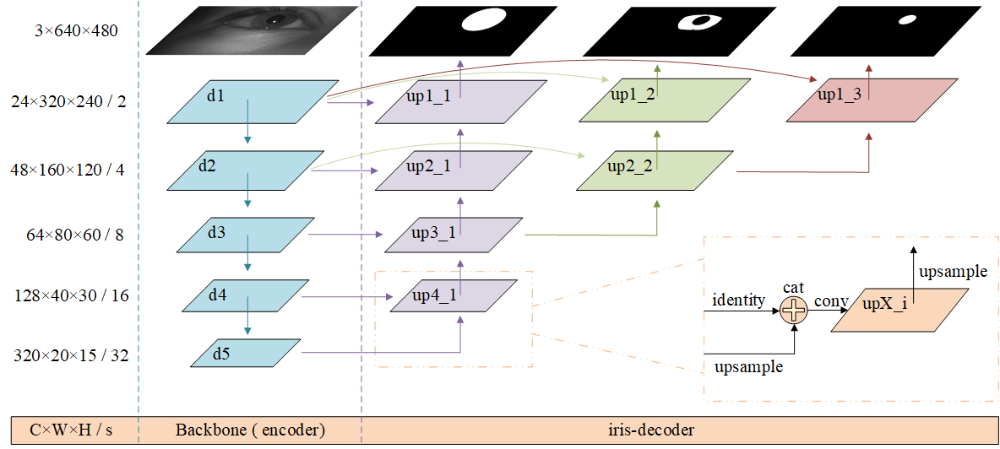

# PI-DECODER

## Introduction
<strong>PI-DECODER</strong>, a decoder structure designed for Precise Iris Segmentation and Location. The decoder structure is shown below:



Please check <a href="./reference/technical paper.pdf">technical paper.pdf</a> in the "reference" subfolder for more details.

## How to use?

For african dataset, you can enter the following script on your terminal:

```bash
python main.py --mode test --model_path ./models/african_best.pth --test_mode 1 --train_dataset african
```

Then you have iris mask, pupil mask and outer iris mask that are predicted by the input images. At the same time, the relevant index data will be displayed on your terminal.

```bash
(ijcb) PS F:\workspace\code\pytorch\PI-DECODER> python main.py --mode test --model_path ./models/african_best.pth --
test_mode 1 --train_dataset african
Namespace(batch_size=1, beta1=0.9, beta2=0.999, img_size=(640, 640), lr=0.0002, mode='test', model_path='./models/af
rican_best.pth', num_epochs=100, num_workers=2, result_path='./result/', test_mode=1, test_path='./dataset/test/', t
rain_dataset='african', train_path='./dataset/train/', valid_path='./dataset/valid/')
image count in train path :5
image count in valid path :5
image count in test path :40
Using Model: PI-DECODER

----------------------------------------------------------------------------------------------------------------
|evaluation     |e1(%)          |e2(%)          |miou(%)        |f1(%)          |miou_back      |f1_back        |
----------------------------------------------------------------------------------------------------------------
|iris seg       |0.384026       |0.192013       |91.175200      |95.350625      |95.386805      |97.574698      |
|iris mask      |0.569627       |0.284813       |93.159855      |96.430411      |96.270919      |98.060105      |
|pupil mask     |0.078793       |0.039396       |93.138878      |96.409347      |96.529547      |98.184718      |
----------------------------------------------------------------------------------------------------------------
|average        |0.344149       |0.172074       |92.491311      |96.063461      |96.062424      |97.939840      |
----------------------------------------------------------------------------------------------------------------

```

Besides, if you <strong>don't have groud-truth files or just want to save the results</strong>, use test mode 2.

```bash
python main.py --mode test --model_path ./models/african_best.pth --test_mode 2 --train_dataset african
```

## Requirements
The whole experiment was run on the <strong>NVIDIA RTX 3060</strong>. The following are <strong>recommended</strong> environment configurations.
```bash
matplotlib        3.3.4
numpy             1.19.5
opencv-python     4.5.1.48
pandas            1.1.5
Pillow            8.1.2
pip               21.0.1
pyparsing         2.4.7
python-dateutil   2.8.1
pytz              2021.1
scipy             1.5.4
setuptools        52.0.0.post20210125
six               1.15.0
thop              0.0.31.post2005241907
torch             1.7.0+cu110
torchstat         0.0.7
torchsummary      1.5.1
torchvision       0.8.1+cu110
```